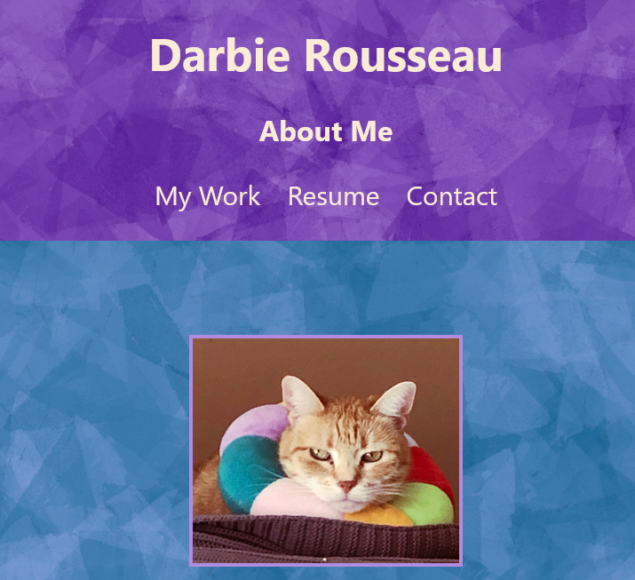
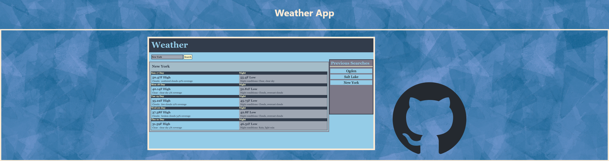
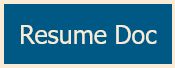
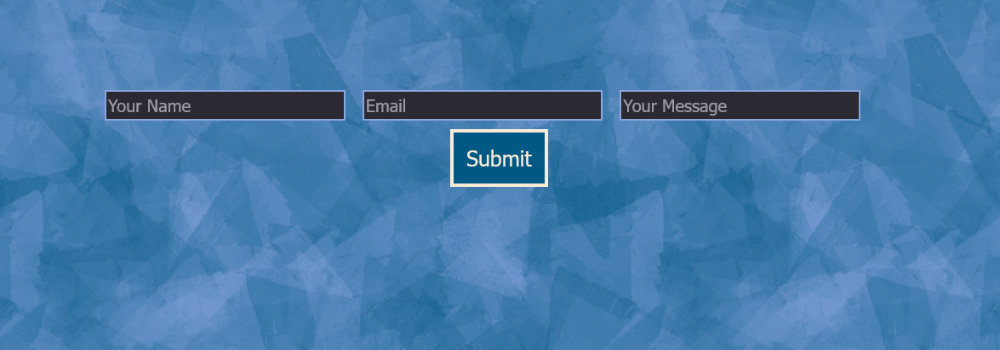
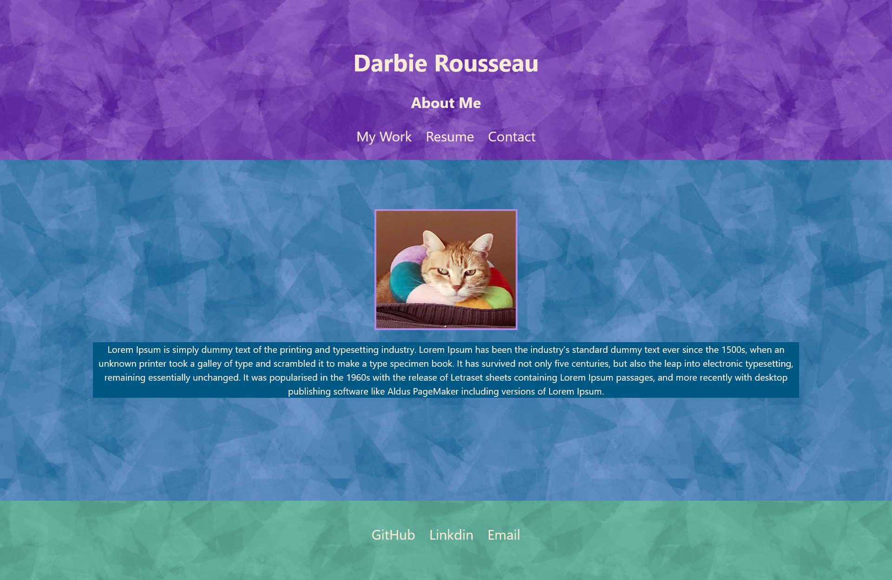
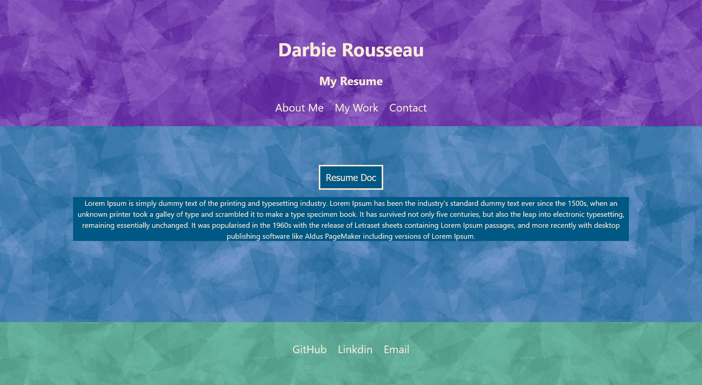
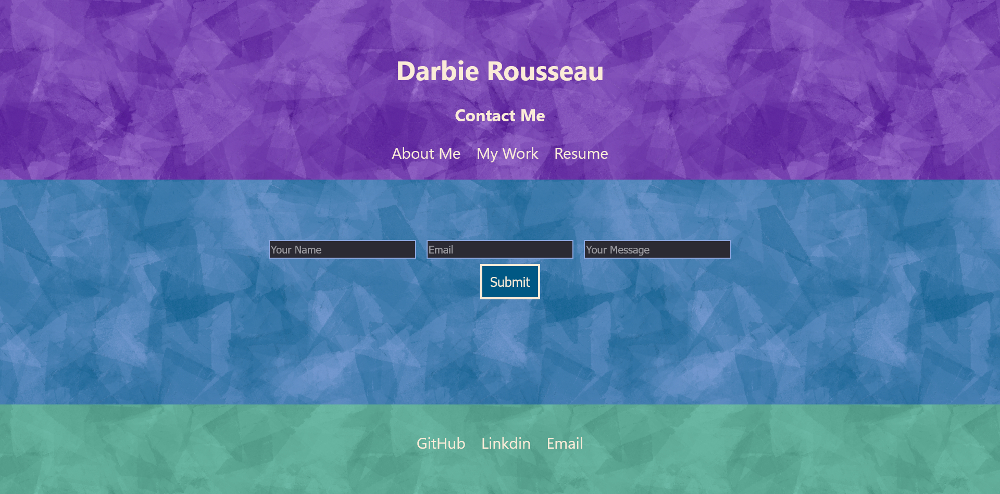

# WorksPortfolio

## Description
This is a portfolio of the deployed apps I made while I was in school.  It has sections to describe myself, link to my work, show my resume and allow users to email me.  This application will be updated periodically with up to date information about myself so that any future employers can look at it and get an idea of my skills.

## Table of Contents

- [Usage](#usage)
- [Credits](#credits)
- [License](#license)

## Usage

From the first page users can see about me.  They can use the navigation to visit the other pages of the application.
  \
My work page displays image links of my applications and their GitHub repositories.
  
The Resume page has the text of my resume and a link to the google document.\
  \
On the contact a user can input their name, email and a message for me.
  

   

## Credits
- [alt text](https://www.youtube.com/watch?v=dG_ETBR8viE)
- [alt text](https://medium.com/@thomasaugot/create-a-react-contact-form-with-email-js-cad2c8606f33)
- emailjs docs

## License

MIT

## ScreenShots

